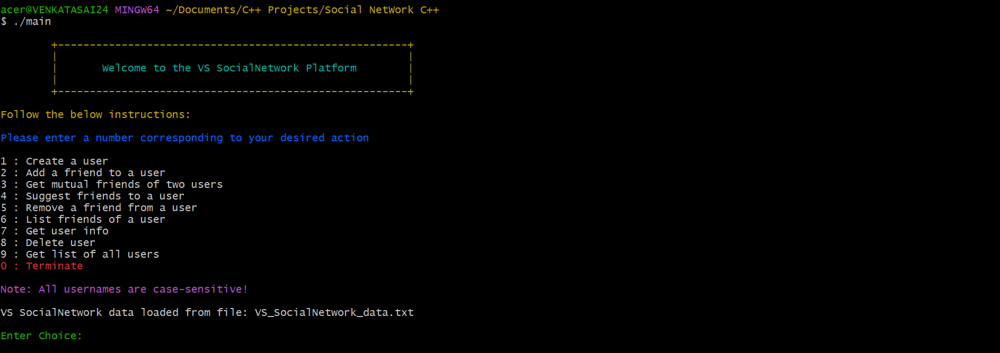
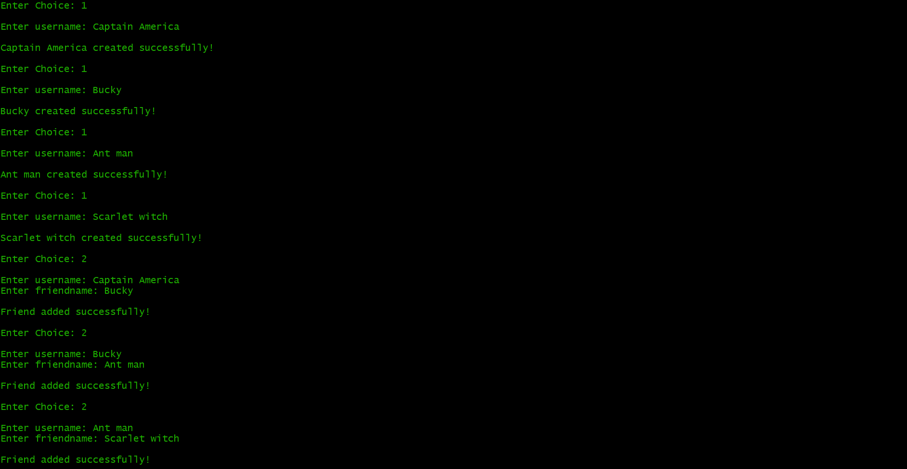
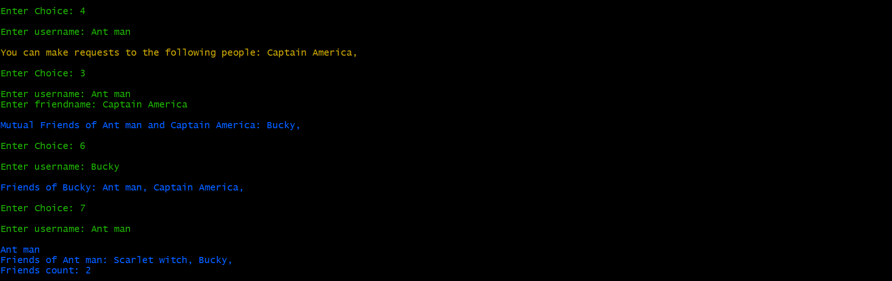
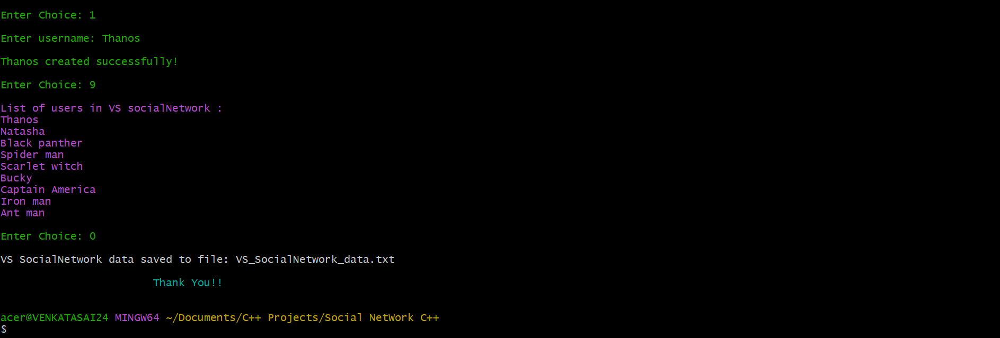

# Social Network

This is a Social Network project implemented in C++. It utilizes various data structures and algorithms to provide functionalities for creating user accounts, managing friend connections, and analyzing social relationships.

## Images






## Data Structures and Algorithms

The Social Network project utilizes the following data structures and algorithms:

- Graph: The network of users and their connections is represented as a graph data structure. Each user is a node, and friend connections are represented as edges between nodes.
- Hash Table: User information, including usernames and their corresponding friends, is stored using a hash table for efficient retrieval and modification.
- Breadth-First Search (BFS): The BFS algorithm is used to suggest friends to a user by exploring the social network graph and identifying potential friends who are directly connected to the user's existing friends. It helps in expanding the social circle by recommending connections based on common acquaintances.

## Features

- User account creation: Users can create their accounts with unique usernames.
- Adding friends: Users can add friends to their network by connecting with other users.
- Removing friends: Users can remove friends from their network to sever connections.
- Viewing mutual friends: Users can see the mutual friends they share with another user.
- Suggesting friends: Users receive suggestions for potential friends based on their existing network.
- User information: Users can get information about their account, such as the number of friends.
- Saving and Retrieving Data: The project allows users to save their social network data to a file and retrieve it later for continued usage.

## Retrieving Past Data

If you have previously saved social network data, you can retrieve it by following these steps:

- Ensure that the data file (VS_SocialNetwork_data.txt) is present in the project directory.
- The program will read the data from the file and populate the social network with the saved information.


## Getting Started

To run the social network project, follow these steps:

- Clone the repository to your local machine.<pre>`git clone https://github.com/venkatasai24/SocialNetwork.git
`</pre>
- Navigate to the project directory.
- Compile the source code using a C++ compiler. <pre>```g++ main.cpp -o SocialNetwork```</pre>
- Run the executable file generated after compilation.<pre>`./SocialNetwork`</pre>
- Follow the on-screen instructions to interact with the social network.

## Contributing

Contributions to the Social Network project are welcome. If you want to contribute, please fork the repository and create a pull request with your proposed changes.
